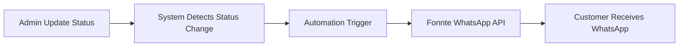
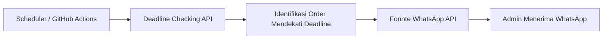

# TNT Sport Apparel — Business Process Automation Case Study

Studi kasus ini menjelaskan bagaimana alur produksi dan komunikasi customer pada bisnis custom
jersey TNT Sport Apparel dipindahkan dari chat manual ke sistem yang otomatis.

Semua detail di bawah diambil dari source code repo ini — bukan estimasi atau asumsi.
Website production: **[www.tntsportapparel.id](https://www.tntsportapparel.id)**

---

## 1. Problem

Sebelum ada sistem ini, operasional harian bergantung pada chat WhatsApp manual:

- **Order dan progress dicatat manual.** Admin harus mengingat dan mencatat sendiri pesanan berada
  di tahap mana. Tidak ada satu sumber data yang bisa dibuka bersama.
- **Update ke customer dikirim satu per satu.** Setiap kali produksi naik tahap, admin harus
  membuka chat customer, mengetik pesan progress, dan mengirimnya. Kalau order sedang banyak,
  update ini gampang tertunda atau terlewat.
- **Customer harus bertanya untuk tahu progress.** Tidak ada tempat untuk melihat status pesanan,
  jadi pertanyaan "pesanan saya sudah sampai mana?" datang berulang kali.
- **Deadline produksi mudah terlewat.** Tidak ada pengingat otomatis untuk order yang mendekati
  tanggal kirim.
- **Perubahan harga, promo, dan kategori hanya hidup di satu orang.** Update katalog berarti minta
  tolong ke orang yang memegang file, bukan mengubah data di satu tempat.

## 2. Solution

Website ini menggantikan proses manual itu dengan tiga lapis:

1. **Single source of truth untuk order & produksi** — pesanan tersimpan di database, lengkap dengan
   tahap produksi aktif (`orders.current_stage` / `orders.current_status`) dan riwayat perubahannya
   (`order_status_history`).
2. **Dashboard admin sebagai satu-satunya titik update** — admin mengubah tahap produksi dari satu
   layar. Sistem yang menyebarkan konsekuensinya: progress dihitung ulang, riwayat dicatat, dan
   customer menerima notifikasi WhatsApp.
3. **Halaman tracking self-service untuk customer** — customer bisa membuka progres pesanannya
   sendiri lewat link di pesan WhatsApp (token bertanda tangan, berlaku 30 hari), atau lewat halaman
   tracking dengan verifikasi nomor HP.

Hasilnya: admin mengerjakan satu aksi (ubah tahap), dan sistem menangani pencatatan, perhitungan
progress, riwayat, serta komunikasi ke customer.

## 3. Production Workflow (11 Tahap)

Alur produksi jersey dipecah menjadi 11 tahap dan dipakai konsisten oleh dashboard admin, halaman
tracking customer, dan template pesan WhatsApp:

| # | Tahap | Status di database | Progress |
| --- | --- | --- | --- |
| 1 | Desain | `desain` | 9% |
| 2 | Layout | `layout` | 18% |
| 3 | Profing Warna | `profing_warna` | 27% |
| 4 | Cetak / Print | `cetak_print` | 36% |
| 5 | Press / Transfer Sublime | `press_transfer` | 45% |
| 6 | Potong Pola / Cutting Panel | `potong_pola` | 55% |
| 7 | Jahit / Sewing | `jahit` | 64% |
| 8 | Finishing | `finishing` | 73% |
| 9 | Quality Control | `quality_control` | 82% |
| 10 | Packing | `packing` | 91% |
| 11 | Kirim | `kirim` → `selesai` | 100% |

Detail yang penting secara operasional:

- **Tahap akhir menuntaskan order.** Begitu admin memindahkan order ke tahap `Kirim`, status order
  menjadi `selesai` dan progress 100% — tanpa perlu mengisi nomor resi lebih dulu.
- **Nomor resi opsional.** Kalau admin mengisinya, halaman tracking menampilkan ekspedisi, nomor
  resi, dan tombol lacak. Kalau kosong, customer melihat status "Selesai" saja.
- **Riwayat tidak hilang.** Setiap perubahan tahap menulis entri baru di `order_status_history`;
  halaman tracking menampilkan riwayat ini sebagai timeline.
- **Tahap lama tetap terbaca.** Order lama dengan penamaan tahap versi lama (mis. `print`, `pres`,
  `potong`) dinormalisasi otomatis, jadi data historis tidak perlu dimigrasi manual.
- **Maklon punya alur sendiri.** Pesanan maklon dipisahkan dalam tabel sendiri dengan 6 tahap
  (Layout → Profing Warna → Cutting Bahan → Press Sublime → QC → Kirim), dashboard sendiri, dan
  halaman tracking sendiri.

## 4. WhatsApp Automation

### Problem

Update progress ke customer adalah pekerjaan berulang yang menyita waktu dan mudah terlewat.

### Alur

1. Admin memilih tahap baru di timeline produksi dashboard, lalu menyimpan.
2. Endpoint menerima perubahan, membandingkan tahap baru dengan tahap di database
   (`previousStage`).
3. Kalau tahap **benar-benar berubah**, sistem menyusun pesan untuk tahap tersebut dan meminta RPC
   `claim_stage_notification` untuk mengklaim slot pengiriman.
4. Kalau klaim berhasil, pesan dikirim lewat Fonnte API. Kalau slot itu sudah pernah diklaim
   (mis. klik dobel, atau request kembar), pengiriman dilewati.
5. Hasil pengiriman dicatat (sukses/gagal + respons) ke `notification_logs`.

### Isi notifikasi

- **Tahap 1–10**: template `UPDATE PESANAN` — nama customer, nomor pesanan, nama tahap aktif,
  progress `n/11`, dan link tracking bertoken.
- **Tahap 11 (Kirim)**: template `PESANAN DIKIRIM` — pesan bahwa pesanan selesai diproduksi dan
  masuk pengiriman, plus link tracking.
- **Maklon**: template terpisah `UPDATE MAKLON` / `MAKLON DIKIRIM` dengan progress `n/6`.

### Keputusan teknis yang menjaga data produksi tetap aman

| Masalah | Penanganan di sistem |
| --- | --- |
| Customer dapat WA dobel | Unique `(order_id, stage)` di `notification_logs` + RPC klaim atomik |
| Klik simpan berkali-kali | Tahap yang sama tidak memicu pengiriman ulang (`skipped_same_stage`) |
| WA gagal, status order ikut gagal | Update status disimpan lebih dulu; hasil WA hanya dicatat |
| Token Fonnte bocor ke browser | Token dienkripsi di `app_settings`, didekripsi server-side saja |
| Dashboard Pesanan tidak punya session Supabase | Operasi DB dibungkus RPC `SECURITY DEFINER`, tabel tetap RLS |
| Customer harus verifikasi ulang dari link WA | Token tracking bertanda tangan HMAC, berlaku 30 hari |

## 5. Deadline Automation

### Problem

Deadline produksi tidak punya pengingat otomatis. Order yang harusnya dikejar hari ini baru sadar
saat customer menanyakan.

### Alur

1. Scheduler memanggil endpoint `GET /api/admin/deadline-notif` dengan `CRON_SECRET`.
2. Endpoint membaca pengaturan dari `app_settings`: aktif/nonaktif, jam kirim
   (`deadline_notif_time`), ambang hari (`deadline_notif_days`, default `3,2,1`), dan daftar nomor
   admin (`deadline_notif_phones`).
3. Order yang statusnya belum selesai difilter berdasarkan selisih hari ke deadline.
4. Ringkasan dikirim ke setiap nomor admin lewat Fonnte, dan tiap pengiriman dicatat ke
   `notification_logs` (termasuk `diff_days`).
5. Order yang berhasil dinotifikasi ditandai `deadline_notified_at`, dan tanggal kirim dicatat di
   `deadline_notif_last_sent_date`.

### Pengingat bertahap

Ambang hari default adalah **H-3, H-2, H-1** (bisa diubah dari dashboard). Jadi order yang sama
mendapat pengingat bertahap saat makin dekat ke deadline — bukan satu peringatan tunggal.

### Penjagaan supaya tidak spam

| Risiko | Penanganan |
| --- | --- |
| Endpoint dipanggil berkali-kali dalam sehari | Flag harian `deadline_notif_last_sent_date` (tanggal WIB) |
| Order yang sama dinotifikasi dobel | Dedup per order lewat `orders.deadline_notified_at` |
| Order yang sudah kelar ikut diingatkan | Order berstatus `selesai` dilewati |
| Endpoint dipanggil sebelum jam kirim | Pengecekan berbasis window; membalas jelas "belum waktunya" |
| Gangguan sesaat database | Endpoint membalas `503` supaya eksekusi berikutnya mencoba lagi |

## 6. Technical Implementation

| Lapisan | Implementasi |
| --- | --- |
| Frontend | Next.js 15 App Router + React 19 + TypeScript + Tailwind CSS |
| Halaman kategori | Satu template (`components/category-landing/`) + satu config (`lib/category-landing.ts`) untuk 9 kategori |
| Database | Supabase Postgres dengan RLS; anon hanya bisa baca, write khusus admin terautentikasi |
| Skema | 25 file migrasi (`supabase/migrations/0001` → `0025`), termasuk RPC notifikasi |
| Riwayat & audit | `order_status_history`, `maklon_status_history`, `notification_logs`, `page_views` |
| Media | Cloudinary unsigned upload + kompresi gambar di browser sebelum upload |
| Auth admin | Supabase Auth untuk CMS `/admin`, shared password cookie untuk dashboard `/pesanan` |
| Proteksi endpoint | `CRON_SECRET` untuk endpoint cron, rate limit per order untuk update tahap |
| Tracking customer | Token HMAC bertanda tangan (`lib/verify-token.ts`) + verifikasi nomor HP |
| SEO | Metadata per halaman, sitemap dinamis, robots, JSON-LD schema.org, `llms.txt` untuk AI crawler |
| Analytics | Meta Pixel (browser) + Conversions API relay (server) dengan dedup `eventID` |
| Automation | GitHub Actions workflow + endpoint pengingat deadline |

## 7. Impact

**Dampak kualitatif** (tidak ada metrik bisnis yang diukur dari sistem ini, jadi tidak ada angka
yang diklaim):

- **Update customer berhenti jadi pekerjaan manual.** Admin tidak lagi mengetik pesan progress satu
  per satu; perubahan tahap di dashboard langsung mengirim notifikasi.
- **Progress order konsisten.** Semua order melewati 11 tahap yang sama, dengan progress yang
  dihitung sistem — bukan perkiraan admin.
- **Customer bisa self-service.** Pertanyaan status pesanan bisa dijawab sendiri lewat link tracking
  di pesan WhatsApp.
- **Deadline lebih terstruktur.** Pengingat H-3/H-2/H-1 otomatis, dengan jejak pengiriman yang bisa
  diperiksa.
- **Konten dan katalog bisa diubah tanpa developer.** Kategori, produk, harga, testimoni, dan promo
  dikelola dari dashboard.
- **Kesalahan manual berkurang.** Anti-duplikat notifikasi dan riwayat perubahan status menghilangkan
  risiko mengirim update dobel atau kehilangan jejak perubahan.

**Skala teknis yang bisa diverifikasi dari repo:**

| Metrik | Nilai |
| --- | --- |
| Commit | 640+ (Juli–September 2026) |
| Landing page kategori | 9 kategori + halaman Fantasy Club & katalog |
| Tahap produksi | 11 tahap (jersey) dan 6 tahap (maklon) |
| File migrasi database | 25 (`0001` → `0025`) |
| Jenis notifikasi WhatsApp | 4 template (tahap jersey, pengiriman jersey, tahap maklon, pengiriman maklon) + ringkasan deadline |
