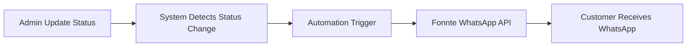
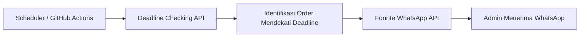

# TNT Sport Apparel

**Website e-commerce & katalog untuk pabrik custom jersey full sublimation — dengan order tracking dan notifikasi WhatsApp otomatis di setiap tahap produksi.**

Admin cukup sekali klik update tahap produksi. Sistem yang mencatat riwayatnya, menghitung progress, dan mengirim WhatsApp ke customer. Tidak ada pesan update yang diketik manual.

<p>
  
  
  
  
  
  
</p>

## Live Website

**🌐 https://www.tntsportapparel.id**

Domain ini dipakai konsisten di seluruh sistem: canonical SEO, link tracking di pesan WhatsApp, sampai workflow cron. Project Vercel-nya bernama `tntsport`, jadi alias teknis `tntsport.vercel.app` juga ada — tapi bukan domain yang dikirim ke customer.

## Overview

TNT Sport Apparel adalah pabrik jersey custom full printing. Sebelum sistem ini, seluruh operasional hidup di chat WhatsApp: order dicatat manual, progress disimpan di kepala admin, dan setiap customer harus bertanya dulu untuk tahu pesanannya sampai mana.

Sekarang seluruh alur itu jalan dari satu tempat:

- **Landing page per cabang olahraga** — hero, katalog, harga, testimoni, dan CTA WhatsApp. Satu template untuk sembilan kategori.
- **Katalog desain dari database** — customer filter kategori, lihat detail, dan order lewat WhatsApp dengan pesan yang otomatis menyebut kode desain.
- **Order flow dua jalur** — tim (min. 6 pcs, desain dari nol) dan satuan (1 pcs dari katalog).
- **Order tracking self-service** — customer cek progres sendiri, kapan pun, tanpa nanya admin.
- **Dashboard operasional** — order, tahap produksi, katalog, dan konten situs dikelola dari satu layar.
- **Automation dua arah** — customer menerima notifikasi tahap produksi otomatis; admin menerima pengingat deadline otomatis.

Hasil akhirnya: admin mengerjakan **satu aksi** (pindah tahap), sistem menyelesaikan sisanya — pencatatan riwayat, perhitungan progress, dan komunikasi ke customer.

## Product Categories

Setiap kategori punya landing page sendiri di `app/`, dipetakan ke katalog di Supabase lewat `lib/category-landing.ts` (`CATEGORY_LANDINGS`):

| Kategori | Landing page | ID katalog |
| --- | --- | --- |
| Sepak Bola / Futsal | `/jersey-futsal` | `sepak-bola-futsal` |
| Voli | `/jersey-voli` | `Volly Ball` |
| Basket | `/jersey-basket` | `basket` |
| Fishing / Mancing | `/jersey-mancing` | `Fishing` |
| Racing | `/jersey-racing` | `racing` |
| Army | `/jersey-army` | `army` |
| Badminton | `/jersey-badminton` | `badminton` |
| Running | `/jersey-running` | `running` |
| Instansi / Corporate | `/corporate-collection` | `instansi-corporate` |
| Fantasy Club | `/fantasy-club` | — (halaman khusus) |

Halaman pendukung: `/katalog` (katalog desain), `/promo-bulan-ini` (promo berjalan), `/karier` (rekrutmen), `/status` & `/track` (tracking customer).

> Catatan: daftar kategori yang tampil di katalog dibaca dari tabel `product_categories` di Supabase. `lib/products.ts` menyediakan data statis sebagai fallback — kategori `racing` punya landing page, tapi belum ada entri desain di fallback statis.

## Tech Stack

Bukan wishlist — semua di bawah ini dipakai di production:

| Bagian | Teknologi | Dipakai untuk |
| --- | --- | --- |
| Framework | **Next.js 15** (App Router), **React 19** | Rendering halaman, API routes, metadata/SEO |
| Bahasa | **TypeScript 5** | Seluruh `app/`, `components/`, `lib/` |
| Styling | **Tailwind CSS 3** + CSS kustom per landing page | Design system + style khas kategori |
| UI | Radix UI, `vaul` (drawer), `lucide-react`, `motion`, `next-themes | Komponen admin, animasi, dark mode |
| Database & Auth | **Supabase** (Postgres, RLS, Supabase Auth) | Order, katalog, konten, pengaturan, log notifikasi |
| Media | **Cloudinary** (unsigned upload preset) | Upload foto design, WO, dan preview produk |
| Messaging | **Fonnte WhatsApp API** | Notifikasi tahap produksi + pengingat deadline |
| Analytics | **Meta Pixel + Conversions API** | Event tracking dari browser & server (dedup `eventID`) |
| Utility | `browser-image-compression`, `clsx`, `tailwind-merge`, `class-variance-authority` | Kompresi gambar sebelum upload, helper styling |
| Automation | **GitHub Actions** | Menjalankan endpoint pengingat deadline |
| Deployment | **Vercel** | Hosting production + environment variables |
| Package manager | **pnpm** | `pnpm-lock.yaml` + `pnpm-workspace.yaml` |

## Key Features

### Customer side

- **Landing page per kategori** — copywriting, harga, testimoni, FAQ, dan template WhatsApp semuanya dari satu config (`lib/category-landing.ts`). Menambah kategori = menambah satu entry, bukan menyalin halaman.
- **Katalog desain dinamis** — dibaca dari Supabase, bisa difilter per kategori, dan setiap desain punya link order WhatsApp yang sudah menyertakan kode desain. Admin tidak perlu bertanya "mau yang mana?".
- **Harga transparan** — mode ecer & lusin dengan penyesuaian harga, plus jalur khusus order 50 pcs+ ke admin.
- **Order tracking dua lapis**:
  - `/track` — masukkan nomor order, diverifikasi dengan nomor HP.
  - `/status?order=...&token=...` — link dari pesan WhatsApp pakai token bertanda tangan (berlaku 30 hari), jadi customer langsung lihat progres tanpa verifikasi ulang.
- **Timeline produksi lengkap** — customer melihat seluruh tahap beserta catatannya, bukan cuma persentase.
- **Info pengiriman otomatis** — ekspedisi, nomor resi, dan tombol lacak muncul di halaman tracking begitu resi diisi admin.
- **Satu klik ke WhatsApp** di semua CTA — order, promo, konsultasi desain, tanya progress.

### Admin side

- **Dashboard Pesanan** (`/pesanan/orders`) — daftar order dengan filter status, pencarian, edit data, foto design & WO, catatan, dan deadline. Semua dalam satu layar.
- **Update tahap produksi sekali klik** — satu aksi menyimpan status, menulis riwayat, menghitung progress ulang, dan mengirim notifikasi WhatsApp ke customer.
- **Dashboard Maklon** (`/pesanan/maklon`) — pesanan maklon punya tabel, 6 tahap produksi, dan halaman tracking sendiri, terpisah dari order jersey.
- **CMS admin** (`/admin/*`) — kelola produk, kategori, kain, fitur katalog, testimoni, review, brand, CTA, social links, badge kepercayaan, dan statistik tanpa menyentuh kode.
- **Pengaturan notifikasi langsung dari dashboard** — jam kirim, hari pengingat (H-3/H-2/H-1), nomor admin penerima, status aktif, plus tombol kirim notifikasi uji.
- **Log notifikasi** — jejak setiap pengiriman WhatsApp: order, nomor tujuan, sukses/gagal, dan respons API-nya.

## Order & Production Tracking

Tahap produksi tersimpan di `orders.current_status` / `orders.current_stage` dan dipakai konsisten oleh dashboard, halaman tracking, dan pesan WhatsApp (`lib/types.ts` → `ORDER_STATUS_LIST`):

| # | Tahap | Status |
| --- | --- | --- |
| 1 | Desain | `desain` |
| 2 | Layout | `layout` |
| 3 | Profing Warna | `profing_warna` |
| 4 | Cetak / Print | `cetak_print` |
| 5 | Press / Transfer Sublime | `press_transfer` |
| 6 | Potong Pola / Cutting Panel | `potong_pola` |
| 7 | Jahit / Sewing | `jahit` |
| 8 | Finishing | `finishing` |
| 9 | Quality Control | `quality_control` |
| 10 | Packing | `packing` |
| 11 | Kirim | `kirim` |

Tahap `Kirim` menuntaskan order: status menjadi `selesai` dan progress 100% — tanpa menunggu nomor resi. Nomor resi opsional: kalau diisi, tombol lacak muncul di halaman customer; kalau kosong, customer melihat status "Selesai".

Pesanan **maklon** memakai rangkaian terpisah (6 tahap): Layout → Profing Warna → Cutting Bahan → Press Sublime → QC → Kirim.

## Business Process Automation

### 1. Notifikasi WhatsApp saat tahap produksi berubah

**Problem.** Sebelum automation, admin harus meng-update status produksi di satu tempat, lalu mengabari customer satu per satu lewat WhatsApp. Saat order ramai, update gampang tertunda, terlewat, atau dobel — dan customer tetap bertanya *"pesananku sudah sampai mana?"*.

**Solution.** Dashboard admin jadi satu-satunya titik update status. Setiap perubahan status otomatis memicu notifikasi WhatsApp — admin tidak mengetik satu pesan pun.

```
Admin update status
  → System mendeteksi perubahan status
  → Automation trigger
  → Fonnte WhatsApp API
  → Customer menerima notifikasi WhatsApp
```



**Isi notifikasi** (template di `lib/fonnte.ts`):

- Nama customer dan nomor pesanan.
- Nama tahap yang sedang dikerjakan + progress `n/11`.
- **Link tracking khusus order itu** — bertoken, berlaku 30 hari, jadi customer langsung lihat progres lengkap tanpa verifikasi HP.
- Tahap terakhir memakai template berbeda: **"PESANAN DIKIRIM"** — pesanan selesai, masuk pengiriman, plus link tracking.
- Pesanan maklon punya template sendiri (`UPDATE MAKLON` / `MAKLON DIKIRIM`, progress `n/6`).

**Kenapa ini aman dipakai di produksi asli:**

- **Anti-duplikat di level database.** Setiap pengiriman "mengklaim" slot dulu lewat RPC `claim_stage_notification` (unique `order_id` + `stage` di `notification_logs`). Klik dobel atau request kembar tidak akan mengirim pesan kedua.
- **Status order tidak pernah gagal gara-gara WhatsApp.** Kegagalan kirim tidak di-rollback — order tetap tersimpan, hanya status notifikasinya yang ditandai gagal.
- **Token Fonnte tidak pernah menyentuh browser.** Disimpan terenkripsi di `app_settings` (AES-256-GCM), didekripsi server-side, dan endpoint dashboard memakai RPC `SECURITY DEFINER` supaya tabel tidak dibuka ke publik (`0020_fonnte_rpc.sql`).

### 2. Pengingat deadline otomatis untuk admin

**Problem.** Deadline produksi gampang terlewat kalau harus diingat manual setiap hari — order yang harusnya dikejar hari ini baru tersadar saat customer menanyakan.

**Solution.** Endpoint `GET /api/admin/deadline-notif` mencari order yang mendekati deadline, lalu mengirim ringkasan ke nomor WhatsApp admin. Jalan tiap hari lewat scheduler.

```
Scheduler (GitHub Actions / cron eksternal)
  → Deadline Checking API
  → Identifikasi order mendekati deadline
  → Fonnte API
  → Admin menerima WhatsApp reminder
```



**Detail implementasi:**

- **Ambang hari diatur dari dashboard** (`deadline_notif_days`, default `3,2,1` → **H-3, H-2, H-1**) bersama jam kirim, daftar nomor admin, dan saklar aktif/nonaktif. Order yang sama dapat pengingat bertahap saat makin dekat deadline.
- **Window, bukan exact match** — kirim kalau jam sekarang sudah lewat/pas jam setting, bukan cuma di menit itu.
- **Dedup dua lapis** supaya tidak spam: flag harian (`deadline_notif_last_sent_date`, tanggal WIB) dan penanda per order (`orders.deadline_notified_at`).
- **Order selesai tidak pernah diingatkan lagi.**
- Setiap pengiriman dicatat ke `notification_logs`, dan endpoint membalas `503` saat database gangguan sesaat — jadi eksekusi berikutnya otomatis mencoba lagi.
- Aksi manual tersedia dari dashboard, plus `.github/workflows/deadline-notif.yml` untuk memicu endpoint dari GitHub Actions.

> **Status trigger saat ini:** jadwal `schedule:` di workflow GitHub sengaja dinonaktifkan (commit `d60884b`), jadi yang aktif adalah `workflow_dispatch` + cron eksternal yang memanggil endpoint.

## Project Structure

```
app/                       Halaman (App Router) + API routes
├─ jersey-*/               Landing page per kategori olahraga
├─ corporate-collection/   Landing page kategori instansi/corporate
├─ fantasy-club/          Landing page Fantasy Club
├─ katalog/               Katalog desain (data dari Supabase)
├─ promo-bulan-ini/        Promo berjalan + flash sale
├─ karier/                Halaman rekrutmen
├─ track/                 Tracking customer (verifikasi nomor HP + token)
├─ status/                Halaman status via link WA (+ /status/maklon)
├─ pesanan/               Dashboard Pesanan & Maklon (login shared password)
├─ admin/                 CMS admin (produk, katalog, konten, pengaturan)
└─ api/                   Endpoint: orders, tracking, notifikasi, upload, CAPI

components/                Komponen UI
├─ category-landing/       Template landing page yang dipakai semua kategori
├─ admin/                  Dashboard Pesanan/Maklon + editor CMS
├─ jersey-*/               Komponen khas tiap kategori
└─ ui/                     Primitif UI (button, drawer, sheet, marquee)

lib/                       Logika bersama: Supabase, Fonnte, tracking token,
                           status order, SEO, rate limit, helpers
supabase/migrations/       Skema + RLS + RPC (0001 → 0025)
public/                    Aset statis (landing, produk, promo, font, llms.txt)
.github/workflows/         Automation (notifikasi deadline)
_archive/                  Landing page & dashboard versi lama (HTML statis)
notifikasi-deadline-dashboard/  Dashboard statis "Notifikasi Deadline" versi awal
```

## Notable Engineering Work

640+ commit dan 500+ deployment via Vercel sepanjang Juli–September 2026. Enam pekerjaan yang paling representatif:

1. **Notifikasi WhatsApp yang aman untuk data produksi asli** — pengiriman diklaim lewat RPC `SECURITY DEFINER` (`claim_stage_notification`), anti-duplikat di level database, dan kegagalan kirim tidak pernah menggagalkan penyimpanan status order.
2. **Token tracking bertanda tangan (HMAC, 30 hari)** — customer membuka halaman tracking dari link WhatsApp tanpa verifikasi ulang, tanpa membuka data order ke publik.
3. **Sistem pengingat deadline yang tidak pernah spam** — window waktu + dedup harian per order (tanggal WIB) + log pengiriman, walau endpoint dipanggil berkali-kali.
4. **Satu sumber kebenaran untuk status produksi** (`lib/order-status.ts`) — aturan "tahap terakhir = selesai = 100%" yang tadinya disalin di empat tempat disatukan, plus normalisasi slug tahap lama supaya data historis tetap terbaca.
5. **Satu template untuk sembilan landing page** — seluruh copywriting, harga, testimoni, FAQ, dan template WA hidup di `lib/category-landing.ts`; sitemap dan SEO mengikuti otomatis saat kategori baru ditambahkan.
6. **Alur maklon terpisah** — tabel, 6 tahapan, dashboard, halaman tracking, dan pipeline notifikasi sendiri, berjalan berdampingan dengan order jersey tanpa saling mengganggu.

## Screenshots

> 🚧 **Placeholder** — tangkapan layar berikutnya akan ditambahkan ke `docs/screenshots/`:
> homepage, katalog, halaman kategori, halaman tracking, dan dashboard admin (dengan data customer di-redact).
>
> Sementara ini, langsung lihat live di **[tntsportapparel.id](https://www.tntsportapparel.id)**.
>
> Referensi visual versi awal ada di `_archive/screenshots/` (internal, tidak ditampilkan di README).

## Local Setup

```bash
pnpm install
cp .env.local.example .env.local   # lalu isi nilainya
pnpm dev
```

Environment variable yang dipakai (nama saja — nilai tidak pernah di-commit):

| Variable | Dipakai untuk |
| --- | --- |
| `NEXT_PUBLIC_SUPABASE_URL` | Koneksi Supabase (client & server) |
| `NEXT_PUBLIC_SUPABASE_ANON_KEY` | Kunci publik anon (read-only lewat RLS) |
| `SUPABASE_SERVICE_ROLE_KEY` | Operasi server untuk endpoint notifikasi |
| `SETTINGS_ENCRYPTION_KEY` | Enkripsi token Fonnte di tabel `app_settings` |
| `TRACK_SESSION_SECRET` | Tanda tangan token tracking customer |
| `PESANAN_PASSWORD` | Password dashboard Pesanan (`/pesanan/*`) |
| `CRON_SECRET` | Proteksi endpoint pengingat deadline |
| `CLOUDINARY_CLOUD_NAME`, `CLOUDINARY_UPLOAD_PRESET` | Upload foto design & WO |
| `NEXT_PUBLIC_CLOUDINARY_CLOUD_NAME`, `NEXT_PUBLIC_CLOUDINARY_UPLOAD_PRESET` | Fallback upload dari client |
| `META_CAPI_ACCESS_TOKEN` | Conversions API Meta (server-side events) |

## Documentation

| Dokumen | Isi |
| --- | --- |
| [`CASE-STUDY.md`](CASE-STUDY.md) | Studi kasus lengkap: problem, solution, workflow, impact |
| [`app/README.md`](app/README.md) | Peta halaman & API routes |
| [`components/README.md`](components/README.md) | Struktur komponen UI |
| [`lib/README.md`](lib/README.md) | Modul logika bersama |
| [`supabase/README.md`](supabase/README.md) | Skema database, RLS, RPC, urutan migrasi |
| [`_archive/README.md`](_archive/README.md) | Isi folder arsip & kenapa disimpan |
| [`notifikasi-deadline-dashboard/README.md`](notifikasi-deadline-dashboard/README.md) | Dashboard statis versi awal |
