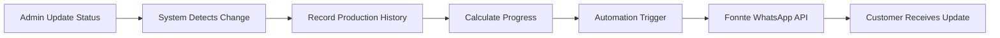
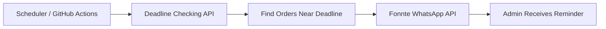

# TNT Sport Apparel

**Production e-commerce & catalog platform untuk pabrik custom jersey full sublimation, dilengkapi customer order tracking dan automated WhatsApp notification di setiap tahap produksi.**

Admin cukup melakukan **satu kali update status produksi**. Sistem otomatis mencatat riwayat, menghitung progress, dan mengirimkan informasi terbaru ke customer melalui WhatsApp.

> **One status update → history recorded → progress calculated → customer notified.**

<p>
  
  
  
  
  
  
</p>

---

## Live Website

🌐 **https://www.tntsportapparel.id**

Production domain digunakan secara konsisten di seluruh sistem, termasuk canonical SEO, customer tracking link, dan workflow automation.

Project Vercel menggunakan nama `tntsport`, sehingga `tntsport.vercel.app` tersedia sebagai technical alias. Namun, domain yang dikirim ke customer adalah **tntsportapparel.id**.

---

## Overview

TNT Sport Apparel adalah platform digital untuk mendukung operasional pabrik **custom jersey full printing**.

Sebelum sistem ini dibangun, sebagian besar proses operasional bergantung pada WhatsApp. Order dicatat secara manual, progress produksi harus dipantau admin, dan customer perlu menghubungi admin untuk mengetahui status pesanannya.

Platform ini mengubah proses tersebut menjadi workflow terintegrasi:

- **Category-based landing pages** untuk berbagai cabang olahraga.
- **Dynamic product catalog** yang terhubung dengan database.
- **Two-way order flow** untuk order tim dan pembelian satuan.
- **Self-service order tracking** agar customer dapat memantau pesanan sendiri.
- **Operational dashboard** untuk mengelola order dan proses produksi.
- **Automated WhatsApp notification** untuk update produksi.
- **Automated deadline reminder** untuk membantu admin memantau order yang mendekati deadline.

Dengan sistem ini, perubahan status produksi tidak lagi berhenti sebagai catatan internal.

**Satu update dari admin menjadi rangkaian proses otomatis yang mencakup pencatatan, perhitungan progress, dan komunikasi kepada customer.**

---

## Product Categories

TNT Sport menggunakan pendekatan **category-driven architecture**: setiap kategori memiliki landing page sendiri, tetapi seluruhnya dibangun dari satu template dan configuration layer yang sama.

| Kategori | Landing Page | Catalog ID |
| --- | --- | --- |
| Sepak Bola / Futsal | `/jersey-futsal` | `sepak-bola-futsal` |
| Voli | `/jersey-voli` | `Volly Ball` |
| Basket | `/jersey-basket` | `basket` |
| Fishing / Mancing | `/jersey-mancing` | `Fishing` |
| Racing | `/jersey-racing` | `racing` |
| Army | `/jersey-army` | `army` |
| Badminton | `/jersey-badminton` | `badminton` |
| Running | `/jersey-running` | `running` |
| Instansi / Corporate | `/corporate-collection` | `instansi-corporate` |
| Fantasy Club | `/fantasy-club` | — (halaman khusus) |

Konfigurasi seluruh landing page dikelola melalui satu file: `lib/category-landing.ts` (`CATEGORY_LANDINGS`).

Dengan pendekatan ini, penambahan kategori tidak membutuhkan pembuatan halaman dari awal — cukup satu entry config, dan copywriting, harga, FAQ, testimoni, template WhatsApp, serta SEO mengikuti otomatis.

### Supporting Pages

- `/katalog` — katalog desain
- `/promo-bulan-ini` — promo berjalan
- `/karier` — halaman rekrutmen
- `/track` — customer tracking
- `/status` — status order melalui tracking link
- `/status/maklon` — tracking order maklon

> Kategori yang tersedia di katalog dibaca dari tabel `product_categories` di Supabase. `lib/products.ts` digunakan sebagai fallback data statis.

---

## Tech Stack

Semua teknologi berikut digunakan dalam production system.

| Layer | Technology | Usage |
| --- | --- | --- |
| Framework | **Next.js 15** + App Router | Application, API routes, metadata & SEO |
| Frontend | **React 19** | UI & interactive components |
| Language | **TypeScript 5** | Application & shared logic |
| Styling | **Tailwind CSS 3** | Design system & responsive styling |
| UI | **Radix UI**, `vaul`, `lucide-react`, `motion`, `next-themes` | UI primitives, drawer, icons, animation, dark mode |
| Database & Auth | **Supabase / PostgreSQL** | Orders, catalog, content, settings & authentication |
| Security | **Row Level Security (RLS)** | Database access control |
| Media | **Cloudinary** | Product, design & WO image uploads |
| Messaging | **Fonnte WhatsApp API** | Production updates & deadline reminders |
| Analytics | **Meta Pixel + Conversions API** | Browser & server-side event tracking |
| Automation | **GitHub Actions** | Scheduled automation workflow |
| Deployment | **Vercel** | Production hosting |
| Utility | `browser-image-compression`, `clsx`, `tailwind-merge`, `cva` | Image compression before upload, styling helpers |
| Package Manager | **pnpm** | Dependency management |

---

## Customer Experience

### Category Landing Pages

Setiap kategori memiliki landing page yang berisi:

- Hero section
- Product catalog
- Pricing
- Testimonials
- FAQ
- WhatsApp CTA

Seluruh landing page menggunakan satu template yang dikontrol melalui configuration layer.

### Dynamic Product Catalog

Catalog mengambil data dari Supabase dan mendukung:

- Category filtering
- Product detail
- Design code
- WhatsApp ordering
- Dynamic product availability

Customer dapat langsung memilih desain dan mengirim order melalui WhatsApp dengan kode desain yang sudah disiapkan oleh sistem.

### Flexible Pricing

Sistem mendukung:

- Harga ecer
- Harga lusin
- Penyesuaian harga berdasarkan quantity
- Jalur khusus untuk order 50+ pcs

### Self-Service Order Tracking

Customer memiliki dua metode untuk melihat progress:

**Manual tracking** — `/track`

Customer memasukkan nomor order dan melakukan verifikasi menggunakan nomor HP.

**Secure tracking link** — `/status?order=...&token=...`

Link tracking dikirim melalui WhatsApp menggunakan signed token yang berlaku selama 30 hari. Customer dapat langsung melihat progress tanpa verifikasi ulang.

Dengan pendekatan ini, customer dapat melihat progress tanpa harus menghubungi admin.

### Production Timeline

Customer dapat melihat tahapan produksi secara lengkap, termasuk catatan pada setiap tahap — bukan hanya persentase.

### Shipping Information

Setelah admin memasukkan informasi pengiriman, halaman tracking dapat menampilkan:

- Nama ekspedisi
- Nomor resi
- Tombol tracking

### WhatsApp Integration

WhatsApp digunakan sebagai communication channel utama untuk:

- Order
- Konsultasi desain
- Promo
- Update produksi
- Tracking order

---

## Admin System

### Order Management

Dashboard Pesanan (`/pesanan/orders`) menyediakan:

- Order listing
- Status filtering
- Search
- Customer information
- Design & WO upload
- Notes
- Production deadline
- Shipping information

Seluruh informasi order dapat dikelola dari satu dashboard.

### One-Click Production Update

Admin cukup mengubah tahap produksi.

Sistem kemudian otomatis:

1. Menyimpan status terbaru.
2. Mencatat riwayat perubahan.
3. Menghitung ulang progress.
4. Menentukan template notifikasi.
5. Mengirim WhatsApp kepada customer.
6. Mencatat hasil pengiriman.

Tidak diperlukan proses update manual melalui WhatsApp.

### CMS

Admin dapat mengelola konten website melalui CMS (`/admin/*`):

- Products
- Categories
- Fabrics
- Catalog
- Testimonials
- Reviews
- Brand information
- CTA
- Social links
- Trust badges
- Statistics

### Notification Management

Pengaturan notification dapat dikontrol langsung dari dashboard:

- Notification schedule
- Deadline reminder days
- Admin recipient numbers
- Active/inactive status
- Test notification

### Notification Logs

Setiap pengiriman WhatsApp dicatat ke database (`notification_logs`), termasuk:

- Order
- Destination number
- Delivery status
- API response

---

## Order & Production Tracking

Production workflow menggunakan 11 tahap utama:

| # | Production Stage | Status |
| --- | --- | --- |
| 1 | Desain | `desain` |
| 2 | Layout | `layout` |
| 3 | Profing Warna | `profing_warna` |
| 4 | Cetak / Print | `cetak_print` |
| 5 | Press / Transfer Sublime | `press_transfer` |
| 6 | Potong Pola / Cutting Panel | `potong_pola` |
| 7 | Jahit / Sewing | `jahit` |
| 8 | Finishing | `finishing` |
| 9 | Quality Control | `quality_control` |
| 10 | Packing | `packing` |
| 11 | Kirim | `kirim` |

Tahap `Kirim` menandai order sebagai selesai dan progress menjadi **100%**.

Nomor resi bersifat opsional. Jika tersedia, customer mendapatkan tombol tracking pada halaman order.

Order maklon menggunakan production workflow terpisah (6 tahap): Layout → Profing Warna → Cutting Bahan → Press Sublime → QC → Kirim.

---

## Business Process Automation

### 1. Automated WhatsApp Production Updates

**Problem**

Sebelum automation, admin harus melakukan dua pekerjaan terpisah:

1. Update status produksi.
2. Mengirim pesan WhatsApp kepada customer.

Ketika jumlah order meningkat, proses manual tersebut berpotensi menyebabkan update terlambat, terlewat, atau terkirim lebih dari sekali.

**Solution**

Dashboard admin menjadi **single source of action** untuk perubahan status.



**Notification Content**

Pesan WhatsApp berisi:

- Nama customer
- Nomor order
- Tahap produksi terbaru
- Progress `n/11`
- Secure tracking link
- Link ke informasi pengiriman ketika order selesai (template `PESANAN DIKIRIM`)

Order maklon menggunakan template dan production workflow terpisah (`UPDATE MAKLON` / `MAKLON DIKIRIM`, progress `n/6`).

**Reliability & Security**

Automation dirancang untuk berjalan dengan aman pada production data:

- **Database-Level Deduplication** — setiap notification terlebih dahulu melakukan claim melalui RPC `claim_stage_notification`. Unique constraint `order_id + stage` mencegah request ganda mengirim notification yang sama lebih dari sekali.
- **WhatsApp Failure Isolation** — kegagalan pengiriman WhatsApp tidak menyebabkan perubahan status order di-rollback. Order tetap tersimpan dan notification ditandai sebagai gagal.
- **Server-Side Credential Protection** — token Fonnte tidak pernah dikirim ke browser. Credential disimpan secara encrypted (AES-256-GCM) di database dan hanya digunakan server-side melalui protected RPC.

### 2. Automated Deadline Reminder

Selain customer notification, sistem juga membantu admin memantau order yang mendekati deadline.



Default reminder:

- H-3
- H-2
- H-1

**Anti-Spam Protection**

Sistem menggunakan beberapa mekanisme untuk mencegah duplicate reminder:

- Daily notification flag (`deadline_notif_last_sent_date`, tanggal WIB)
- Per-order notification timestamp (`deadline_notified_at`)
- Time window instead of exact-minute matching
- Notification logs
- Completed orders excluded automatically

Automation dapat dijalankan melalui GitHub Actions maupun cron eksternal.

> **Current trigger:** scheduled GitHub Actions workflow sengaja dinonaktifkan (commit `d60884b`). Workflow yang tersedia menggunakan `workflow_dispatch`, sementara production scheduler menggunakan cron eksternal.

---

## Engineering Highlights

Enam bagian yang paling representatif dari project ini (640+ commit, Juli–September 2026):

### 1. Production-Grade WhatsApp Automation

Notification pipeline menggunakan database-level claim, deduplication, protected server-side credentials, dan failure isolation — aman untuk data produksi asli.

### 2. Secure Customer Tracking

Customer tracking menggunakan signed HMAC token dengan masa berlaku 30 hari sehingga customer dapat membuka tracking link tanpa mengekspos data order secara publik.

### 3. Reliable Deadline Reminder

Deadline reminder menggunakan time window, daily deduplication, per-order tracking, dan notification logging untuk menghindari spam.

### 4. Single Source of Truth for Production Status

Aturan production status dipusatkan di `lib/order-status.ts` sehingga dashboard, customer tracking, dan WhatsApp notification menggunakan status definition yang sama — termasuk normalisasi data tahap lama.

### 5. Reusable Category Architecture

Sembilan landing page kategori menggunakan satu template dan configuration layer. Penambahan kategori baru tidak membutuhkan duplikasi halaman.

### 6. Separate Maklon Workflow

Order maklon memiliki:

- Production stages sendiri (6 tahap)
- Dashboard sendiri
- Tracking page sendiri
- Notification template sendiri

Workflow tersebut berjalan berdampingan dengan order jersey utama tanpa mencampurkan business logic.

---

## Project Structure

```text
app/
├─ jersey-*/               Landing page kategori olahraga
├─ corporate-collection/   Landing page instansi/corporate
├─ fantasy-club/           Landing page Fantasy Club
├─ katalog/                Dynamic product catalog
├─ promo-bulan-ini/        Promo & flash sale
├─ karier/                 Recruitment page
├─ track/                  Customer tracking
├─ status/                 Tracking via WhatsApp link
├─ pesanan/                Order & Maklon dashboard
├─ admin/                  CMS & administration
└─ api/                    API routes

components/
├─ category-landing/       Reusable category landing components
├─ admin/                  Admin dashboard & CMS components
├─ jersey-*/               Category-specific components
└─ ui/                     Shared UI primitives

lib/
├─ Supabase
├─ Fonnte
├─ order status
├─ tracking token
├─ SEO
├─ rate limiting
└─ shared utilities

supabase/
└─ migrations/             Database schema, RLS & RPC

public/
└─ assets                  Images, fonts & static assets

.github/
└─ workflows/              Automation workflow

_archive/
└─ Legacy static pages & previous versions
```

---

## Screenshots

> Screenshots production akan ditambahkan ke `docs/screenshots/`.

Planned screenshots:

- Homepage
- Category landing page
- Product catalog
- Product detail
- Customer tracking
- Admin dashboard
- Production order management

Data customer pada screenshot harus di-redact sebelum dipublikasikan.

Untuk melihat implementasi production saat ini:

🌐 **[https://www.tntsportapparel.id](https://www.tntsportapparel.id)**

---

## Local Development

```bash
pnpm install
cp .env.local.example .env.local
pnpm dev
```

Environment variables yang digunakan:

| Variable | Purpose |
| --- | --- |
| `NEXT_PUBLIC_SUPABASE_URL` | Supabase connection |
| `NEXT_PUBLIC_SUPABASE_ANON_KEY` | Public Supabase client key |
| `SUPABASE_SERVICE_ROLE_KEY` | Server-side operations |
| `SETTINGS_ENCRYPTION_KEY` | Encrypt application credentials |
| `TRACK_SESSION_SECRET` | Tracking token signing |
| `PESANAN_PASSWORD` | Order dashboard authentication |
| `CRON_SECRET` | Protect deadline notification endpoint |
| `CLOUDINARY_CLOUD_NAME` | Cloudinary configuration |
| `CLOUDINARY_UPLOAD_PRESET` | Image upload configuration |
| `NEXT_PUBLIC_CLOUDINARY_CLOUD_NAME` | Fallback untuk upload dari client |
| `NEXT_PUBLIC_CLOUDINARY_UPLOAD_PRESET` | Fallback untuk upload dari client |
| `META_CAPI_ACCESS_TOKEN` | Meta server-side events |

> **Never commit actual credentials or secrets to the repository.**

---

## Documentation

| Document | Description |
| --- | --- |
| [`CASE-STUDY.md`](CASE-STUDY.md) | Full project case study |
| [`app/README.md`](app/README.md) | Application pages & API routes |
| [`components/README.md`](components/README.md) | Component architecture |
| [`lib/README.md`](lib/README.md) | Shared business logic |
| [`supabase/README.md`](supabase/README.md) | Database schema, RLS & RPC |
| [`_archive/README.md`](_archive/README.md) | Archived legacy implementation |
| [`notifikasi-deadline-dashboard/README.md`](notifikasi-deadline-dashboard/README.md) | Early deadline notification dashboard |

---

## Project Summary

TNT Sport Apparel bukan hanya katalog jersey.

Project ini menggabungkan **e-commerce, customer tracking, production management, database-driven CMS, WhatsApp automation, deadline monitoring, dan operational tooling** dalam satu production platform.

Fokus utamanya adalah mengubah proses operasional yang sebelumnya bergantung pada komunikasi manual menjadi workflow yang lebih terstruktur dan otomatis.

> **Update sekali. Sistem mengurus sisanya.**
