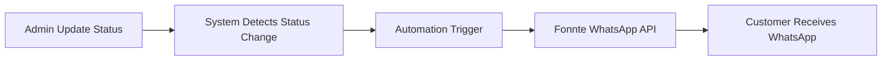
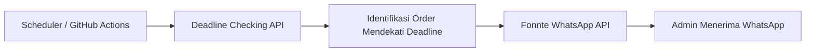
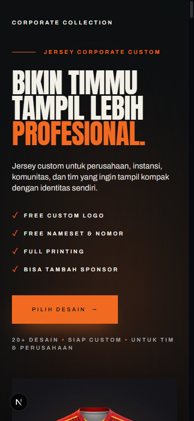
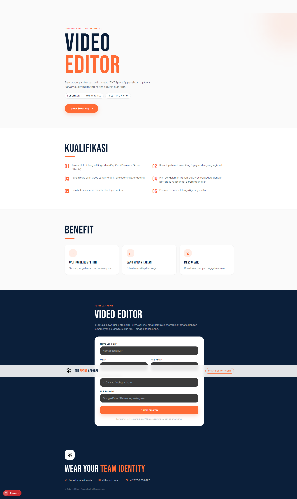

# TNT Sport Apparel

**Website e-commerce & katalog untuk bisnis custom jersey printing full sublimation.**

Dari landing page per cabang olahraga, katalog desain, form order, sampai dashboard admin untuk
mengelola produksi dan mengirim notifikasi WhatsApp otomatis ke customer.

<p>
  
  
  
  
  
  
</p>

## Live Website

**🌐 https://www.tntsportapparel.id**

Domain itu yang dipakai konsisten di seluruh source code: canonical SEO, link tracking di pesan
WhatsApp, dan workflow cron. Project Vercel-nya bernama `tntsport`, jadi alias teknis
`tntsport.vercel.app` juga ada, tetapi **bukan** domain publik yang dipakai — semua link yang
dikirim ke customer mengarah ke `www.tntsportapparel.id`.

## Overview

TNT Sport Apparel adalah pabrik jersey custom full printing. Sebelum ada sistem ini, order masuk
lewat chat WhatsApp, progress produksi dicatat manual, dan customer harus bertanya satu-satu soal
status pesanannya.

Sekarang website ini jadi satu pintu untuk seluruh alur bisnis:

- **Landing page per cabang olahraga** dengan katalog desain, harga, testimoni, dan CTA WhatsApp.
- **Katalog desain** yang dibaca dari database dan bisa dikelola dari dashboard admin.
- **Order flow** untuk tim (min. 6 pcs, desain dari nol) maupun satuan (1 pcs dari katalog).
- **Order tracking** yang bisa dibuka customer tanpa perlu tanya admin.
- **Dashboard admin** untuk mengelola order, tahap produksi, katalog, dan konten.
- **Automation**: notifikasi WhatsApp otomatis saat tahap produksi berubah, dan pengingat deadline
  otomatis untuk admin.

## Product Categories

Semua kategori di bawah ini punya landing page sendiri di `app/`, dan dipetakan ke kategori katalog
di Supabase lewat `lib/category-landing.ts` (`CATEGORY_LANDINGS`).

| Kategori | Landing page | ID katalog |
| --- | --- | --- |
| Sepak Bola / Futsal | `/jersey-futsal` | `sepak-bola-futsal` |
| Voli | `/jersey-voli` | `Volly Ball` |
| Basket | `/jersey-basket` | `basket` |
| Fishing / Mancing | `/jersey-mancing` | `Fishing` |
| Racing | `/jersey-racing` | `racing` |
| Army | `/jersey-army` | `army` |
| Badminton | `/jersey-badminton` | `badminton` |
| Running | `/jersey-running` | `running` |
| Instansi / Corporate | `/corporate-collection` | `instansi-corporate` |
| Fantasy Club | `/fantasy-club` | — (halaman khusus) |

Halaman pendukung: `/katalog` (katalog desain), `/promo-bulan-ini` (promo berjalan),
`/karier` (rekrutmen), `/status` & `/track` (tracking customer).

> Catatan: daftar kategori yang benar-benar tampil di katalog dibaca dari tabel
> `product_categories` di Supabase. `lib/products.ts` menyediakan data statis sebagai fallback /
> seed (`CATALOG_PRODUCTS`) — kategori `racing` ada sebagai landing page, tapi belum punya entri
> desain di fallback statis.

## Tech Stack

Diambil langsung dari `package.json` dan konfigurasi repo — bukan daftar wishlist.

| Bagian | Teknologi | Dipakai untuk |
| --- | --- | --- |
| Framework | **Next.js 15** (App Router), **React 19** | Rendering halaman, API routes, metadata/SEO |
| Bahasa | **TypeScript 5** | Seluruh `app/`, `components/`, `lib/` |
| Styling | **Tailwind CSS 3** + CSS kustom per landing page | Design system + style khusus kategori/marketing |
| UI | Radix UI, `vaul` (drawer), `lucide-react`, `motion`, `next-themes` | Komponen admin, animasi, dark mode |
| Database & Auth | **Supabase** (Postgres, RLS, Supabase Auth) | Order, katalog, konten, pengaturan, log notifikasi |
| Media | **Cloudinary** (unsigned upload preset) | Upload foto design, WO, dan preview produk |
| Messaging | **Fonnte WhatsApp API** | Notifikasi tahap produksi + pengingat deadline |
| Analytics | **Meta Pixel + Conversions API** | Event tracking dari browser & server (dedup `eventID`) |
| Utility | `browser-image-compression`, `clsx`, `tailwind-merge`, `class-variance-authority` | Kompresi gambar sebelum upload, helper styling |
| Automation | **GitHub Actions** | Menjalankan endpoint pengingat deadline |
| Deployment | **Vercel** | Hosting production + environment variables |
| Package manager | **pnpm** | `pnpm-lock.yaml` + `pnpm-workspace.yaml` |

## Key Features

### Customer side

- **Landing page per kategori** dengan hero, katalog desain, pricing ecer/lusin, langkah order,
  testimoni, FAQ, dan CTA WhatsApp (semua isi dari satu file config — `lib/category-landing.ts`).
- **Katalog desain** dinamis dari Supabase: filter per kategori, detail desain, link langsung ke
  WhatsApp dengan pesan yang menyebut kode desain.
- **Harga transparan**: mode ecer & lusin dengan penyesuaian harga, plus jalur "50 pcs+" ke admin.
- **Order tracking** dua lapis:
  - `/track` — customer memasukkan nomor order, diverifikasi dengan nomor HP, lalu dapat token
    sesi bertanda tangan (HMAC).
  - `/status?order=...&token=...` — link tracking di pesan WhatsApp memakai token 30 hari, jadi
    customer bisa langsung membuka progres tanpa verifikasi ulang.
- **Halaman tracking maklon** (`/status/maklon`) dengan tahapan terpisah, dan **timeline progres**
  yang menampilkan seluruh tahap produksi beserta catatan tiap tahap.
- **Info pengiriman** (ekspedisi + nomor resi + tombol lacak) muncul di halaman tracking kalau
  resinya memang sudah diisi.
- **Komunikasi WhatsApp** satu klik di semua CTA (order, promo, konsultasi desain, tanya progress).

### Admin side

- **Dashboard Pesanan** (`/pesanan/orders`) — daftar order dengan filter status, pencarian, edit
  data order, timeline tahap produksi, foto design & WO, catatan, dan deadline.
- **Update tahap produksi** — memilih tahap di timeline langsung menyimpan status produksi,
  menghitung progress otomatis, menulis riwayat status, dan memicu notifikasi WhatsApp ke customer.
- **Dashboard Maklon** (`/pesanan/maklon`) — pesanan maklon punya tabel, tahapan (6 tahap),
  dashboard, dan halaman tracking sendiri.
- **CMS admin** (`/admin/*`) — kelola produk & kategori, kain, fitur katalog, testimoni, review,
  brand, tautan CTA, social links, badge kepercayaan, dan statistik.
- **Pengaturan notifikasi** — mengatur jam kirim, hari pengingat (H-3/H-2/H-1), nomor admin
  penerima, status aktif, plus tombol kirim notifikasi uji.
- **Log notifikasi** (`notification_logs`) — jejak setiap pengiriman WA: order, nomor, status
  kirim/gagal, dan isi respons.

## Order & Production Tracking

Tahap produksi order jersey tersimpan di `orders.current_status` / `orders.current_stage` dan
dipakai konsisten oleh dashboard, halaman tracking, dan pesan WhatsApp
(`lib/types.ts` → `ORDER_STATUS_LIST`):

| # | Tahap | Status |
| --- | --- | --- |
| 1 | Desain | `desain` |
| 2 | Layout | `layout` |
| 3 | Profing Warna | `profing_warna` |
| 4 | Cetak / Print | `cetak_print` |
| 5 | Press / Transfer Sublime | `press_transfer` |
| 6 | Potong Pola / Cutting Panel | `potong_pola` |
| 7 | Jahit / Sewing | `jahit` |
| 8 | Finishing | `finishing` |
| 9 | Quality Control | `quality_control` |
| 10 | Packing | `packing` |
| 11 | Kirim | `kirim` |

Tahap terakhir (`Kirim`) menuntaskan order: status menjadi `selesai` dan progress 100%. Nomor resi
bersifat opsional — kalau admin mengisinya, tombol lacak muncul di halaman customer; kalau kosong,
customer cukup melihat status "Selesai".

Pesanan **maklon** memakai rangkaian terpisah (6 tahap): Layout → Profing Warna → Cutting Bahan →
Press Sublime → QC → Kirim.

## Business Process Automation

### 1. Notifikasi WhatsApp saat tahap produksi berubah

**Problem.** Sebelum automation, admin harus meng-update status produksi di satu tempat lalu
mengabari progress pesanan ke customer satu per satu lewat WhatsApp. Order yang sedang banyak
gampang terlewat, dan customer tetap akan bertanya "pesananku sudah sampai mana?".

**Solution.** Dashboard admin jadi satu-satunya titik update status. Setiap perubahan status
otomatis memicu notifikasi WhatsApp ke customer — admin tidak perlu mengetik pesan apa pun.

```
Admin update status
  → System mendeteksi perubahan status
  → Automation trigger
  → Fonnte WhatsApp API
  → Customer menerima notifikasi WhatsApp
```



Isi pesan (template di `lib/fonnte.ts`):

- Nama customer dan nomor pesanan.
- Nama tahap yang sedang dikerjakan + progress `n/11` (contoh: "Press / Transfer Sublime",
  progress 5/11).
- **Link tracking** khusus order tersebut, dengan token bertanda tangan yang berlaku 30 hari —
  customer bisa cek progres lengkap tanpa verifikasi HP lagi.
- Tahap terakhir memakai template berbeda: "PESANAN DIKIRIM", berisi link tracking dan penutup.
- Pesanan maklon punya template sendiri (`UPDATE MAKLON` / `MAKLON DIKIRIM`, progress `n/6`).

Detail teknis yang bikin ini aman di data produksi asli:

- **Anti-duplikat di level database.** Setiap pengiriman "mengklaim" slot dulu lewat RPC
  `claim_stage_notification` (unique `order_id` + `stage` di `notification_logs`). Request kembar
  atau klik dobel tidak akan mengirim pesan kedua.
- **Status order tidak pernah gagal gara-gara WA.** Kegagalan kirim tidak di-rollback; order tetap
  tersimpan dan hanya status notifikasinya yang ditandai gagal.
- **Token Fonnte tidak pernah menyentuh browser.** Disimpan terenkripsi di tabel `app_settings`,
  didekripsi server-side (`lib/fonnte-crypto.ts`), dan endpoint dashboard memakai RPC
  `SECURITY DEFINER` supaya tidak perlu membuka tabel ke publik (`0020_fonnte_rpc.sql`).

### 2. Pengingat deadline otomatis untuk admin

**Problem.** Deadline produksi order mudah terlewat kalau harus diingat manual setiap hari.

**Solution.** Endpoint `GET /api/admin/deadline-notif` mencari order yang mendekati deadline lalu
mengirim ringkasan ke nomor WhatsApp admin.

```
Scheduler (GitHub Actions / cron eksternal)
  → Deadline Checking API
  → Identifikasi order mendekati deadline
  → Fonnte API
  → Admin menerima WhatsApp reminder
```



Detail implementasi:

- **Ambang hari** diatur di database (`deadline_notif_days`, default `3,2,1` → **H-3, H-2, H-1**)
  bersama jam kirim (`deadline_notif_time`), daftar nomor admin (`deadline_notif_phones`), dan
  saklar aktif/nonaktif (`deadline_notif_enabled`).
- **Window, bukan exact match.** Endpoint mengirim kalau jam sekarang sudah lewat/pas jam setting,
  bukan hanya tepat di detik itu.
- **Dedup dua lapis** supaya tidak spam: flag harian (`deadline_notif_last_sent_date`, tanggal WIB)
  dan penanda per order (`orders.deadline_notified_at`).
- **Anti-duplikat kirim ulang**: order yang statusnya sudah `selesai` tidak pernah diingatkan.
- Pengiriman dicatat ke tabel `notification_logs` (order, nomor, status, respons), dan endpoint
  membalas `503` untuk gangguan database sesaat supaya eksekusi berikutnya otomatis mencoba lagi.
- Aksi manual tersedia dari dashboard, plus file workflow `.github/workflows/deadline-notif.yml`
  untuk memicu endpoint dari GitHub Actions.

> **Status trigger saat ini:** jadwal `schedule:` di workflow GitHub sengaja dinonaktifkan
> (commit `d60884b`), jadi yang aktif adalah `workflow_dispatch` + cron eksternal yang memanggil
> endpoint. Lihat bagian *Potential Issues* di laporan housekeeping repo untuk detailnya.

## Project Structure

```
app/                       Halaman (App Router) + API routes
├─ jersey-*/               Landing page per kategori olahraga
├─ corporate-collection/   Landing page kategori instansi/corporate
├─ fantasy-club/           Landing page Fantasy Club
├─ katalog/                Katalog desain (data dari Supabase)
├─ promo-bulan-ini/        Promo berjalan + flash sale
├─ karier/                 Halaman rekrutmen
├─ track/                  Tracking customer (verifikasi nomor HP + token)
├─ status/                 Halaman status via link WA (+ /status/maklon)
├─ pesanan/                Dashboard Pesanan & Maklon (login shared password)
├─ admin/                  CMS admin (produk, katalog, konten, pengaturan)
└─ api/                    Endpoint: orders, tracking, notifikasi, upload, CAPI

components/                Komponen UI
├─ category-landing/       Template landing page yang dipakai semua kategori
├─ admin/                  Dashboard Pesanan/Maklon + editor CMS
├─ jersey-*/               Komponen khas tiap kategori
└─ ui/                     Primitif UI (button, drawer, sheet, marquee)

lib/                       Logika bersama: Supabase, Fonnte, tracking token,
                           status order, SEO, rate limit, helpers
supabase/migrations/       Skema + RLS + RPC (0001 → 0025)
public/                    Aset statis (landing, produk, promo, font, llms.txt)
.github/workflows/         Automation (notifikasi deadline)
_archive/                  Landing page & dashboard versi lama (HTML statis)
notifikasi-deadline-dashboard/  Dashboard statis "Notifikasi Deadline" versi awal
```

## Notable Engineering Work

Diambil dari riwayat commit repo (640+ commit, Juli–September 2026):

1. **Notifikasi WhatsApp otomatis yang aman untuk data produksi asli** — pengiriman diklaim lewat
   RPC `SECURITY DEFINER` (`claim_stage_notification`) sehingga anti-duplikat di level database,
   dan kegagalan kirim tidak pernah menggagalkan penyimpanan status order.
2. **Token tracking bertanda tangan (HMAC, 30 hari)** — link di pesan WhatsApp bisa membuka halaman
   tracking tanpa membuat customer memasukkan nomor HP lagi, tanpa membuka data order ke publik.
3. **Sistem pengingat deadline** — pengecekan berbasis window waktu + dedup harian per order
   (tanggal WIB) + log pengiriman, supaya reminder tidak pernah dobel walau endpoint dipanggil
   berkali-kali.
4. **Satu sumber kebenaran untuk status produksi** (`lib/order-status.ts`) — aturan "tahap terakhir =
   selesai = 100%" yang tadinya disalin di empat tempat disatukan, plus normalisasi slug tahap lama
   supaya data historis tetap terbaca.
5. **Satu template untuk sembilan landing page kategori** — seluruh copywriting, harga, testimoni,
   FAQ, dan template WA hidup di `lib/category-landing.ts`; sitemap dan halaman SEO mengikuti
   otomatis saat kategori baru ditambahkan.
6. **Alur maklon terpisah** — tabel, tahapan (6), dashboard, halaman tracking, dan pipeline
   notifikasi sendiri, jalan berdampingan dengan alur order jersey tanpa saling mengganggu.

## Screenshots




Aset di atas adalah tangkapan layar nyata dari halaman project ini di `_archive/screenshots/`.
Untuk pengalaman penuh (katalog, tracking, dashboard admin) langsung buka
**[tntsportapparel.id](https://www.tntsportapparel.id)**.

## Local Setup

```bash
pnpm install
cp .env.local.example .env.local   # lalu isi nilainya
pnpm dev
```

Environment variable yang dipakai (nama saja — nilainya tidak pernah di-commit):

| Variable | Dipakai untuk |
| --- | --- |
| `NEXT_PUBLIC_SUPABASE_URL` | Koneksi Supabase (client & server) |
| `NEXT_PUBLIC_SUPABASE_ANON_KEY` | Kunci publik anon (read-only lewat RLS) |
| `SUPABASE_SERVICE_ROLE_KEY` | Operasi server untuk endpoint notifikasi |
| `SETTINGS_ENCRYPTION_KEY` | Enkripsi token Fonnte di tabel `app_settings` |
| `TRACK_SESSION_SECRET` | Tanda tangan token tracking customer |
| `PESANAN_PASSWORD` | Password dashboard Pesanan (`/pesanan/*`) |
| `CRON_SECRET` | Proteksi endpoint pengingat deadline |
| `CLOUDINARY_CLOUD_NAME`, `CLOUDINARY_UPLOAD_PRESET` | Upload foto design & WO |
| `NEXT_PUBLIC_CLOUDINARY_CLOUD_NAME`, `NEXT_PUBLIC_CLOUDINARY_UPLOAD_PRESET` | Fallback upload dari client |
| `META_CAPI_ACCESS_TOKEN` | Conversions API Meta (server-side events) |

## Documentation

| Dokumen | Isi |
| --- | --- |
| [`CASE-STUDY.md`](CASE-STUDY.md) | Studi kasus lengkap: problem, solution, workflow, impact |
| [`app/README.md`](app/README.md) | Peta halaman & API routes |
| [`components/README.md`](components/README.md) | Struktur komponen UI |
| [`lib/README.md`](lib/README.md) | Modul logika bersama |
| [`supabase/README.md`](supabase/README.md) | Skema database, RLS, RPC, urutan migrasi |
| [`_archive/README.md`](_archive/README.md) | Isi folder arsip & kenapa disimpan |
| [`notifikasi-deadline-dashboard/README.md`](notifikasi-deadline-dashboard/README.md) | Dashboard statis versi awal |
